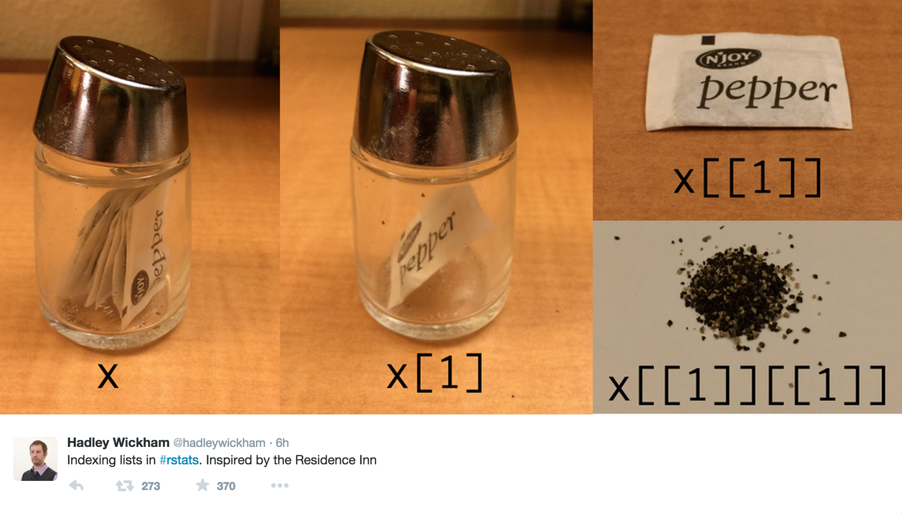

# Data Frames

A data frame is one of the most commonly used data structure in R (see the `tibble` object in the *Data Wrangling* lab), they are just a list of equal length vectors. Each vector is treated as a column and elements of the vectors as rows.

Most often a data frame will be constructed by reading in from a file, but we can also create them from scratch as done below:

```{r}
df <- data.frame(x = 1:3, y = c("a", "b", "c"))
str(df)
```

It is extremely important to understand that data frames are simply a special form of a list:
```{r}
typeof(df)
```


```{r}
attributes(df)
```

```{r}
df2 <- list(x = 1:3, y = factor(c("a", "b", "c")))
attr(df2, "class") <- "data.frame"
attr(df2, "row.names") <- 1:3
str(df2)
```


# Strings (Characters) vs Factors

By default R will convert character vectors into factors when they are included in a data frame.

Sometimes this is useful, sometimes usually it isn't -- either way it is important to know what type/class you are working with. This behavior can be changed using the `stringsAsFactors` argument.

```{r}
df <- data.frame(x = 1:3, y = c("a", "b", "c"), stringsAsFactors = FALSE)
str(df)
```

### Some general `stringsAsFactors` advice
You almost *always* want `stringsAsFactors = FALSE`

Here is a little [background](https://simplystatistics.org/2015/07/24/stringsasfactors-an-unauthorized-biography/)

<center>

</center>


--------------------------


# Length Coercion

As we have seen before, if a vector is shorter than expected, R will increase the length by repeating elements of the short vector. If the lengths are evenly divisible this will occur without any output / warning.

For data frames if the lengths are not evenly divisible then there will be an error.

```{r}
data.frame(x = 1:3, y = c("a"))
```
```{r, error = TRUE}
data.frame(x = 1:3, y = c("a","b"))
```


# Growing data frames

We can add rows or columns to a data frame using `rbind` and `cbind` respectively.

```{r}
df <- data.frame(x = 1:3, y = c("a", "b", "c"))
str(rbind(df, c(TRUE, FALSE)))
```

```{r}
str(cbind(df, z = TRUE))
```

```{r}
df1 <- data.frame(x = 1:3, y = c("a","b","c"))
df2 <- data.frame(m = 3:1, n = c(TRUE, TRUE, FALSE))
str(cbind(df1, df2))
```

```{r}
# Bad
str(rbind(cbind(df1, df2), c(1, "a", 1, 1)))
```

```{r}
# Good
str(rbind(cbind(df1, df2), list(1, "a", 1, 1)))
```

# Exercise 1

    1. Construct a data frame that contains the following data (in as efficient a manner as possible). *Hint:* the `rep` function should prove useful (`?rep`).

  Patient    Gender          Treatment 1     Treatment 2     Treatment 3
---------- --------------- --------------- --------------- ---------------
  1          Male            Yes             Yes             Yes
  2          Male            Yes             Yes             No 
  3          Male            Yes             No              Yes
  4          Male            Yes             No              No
  5          Male            No              Yes             Yes
  6          Male            No              Yes             No
  7          Male            No              No              Yes
  8          Male            No              No              No
  9          Female          Yes             Yes             Yes 
  10         Female          Yes             Yes             No
  11         Female          Yes             No              Yes
  12         Female          Yes             No              No
  13         Female          No              Yes             Yes
  14         Female          No              Yes             No
  15         Female          No              No              Yes
  16         Female          No              No              No

    2. Why does the following fail, i.e. should fail IMHO?
```{r grow_df, error = TRUE}
df <- data.frame(x = 1:3, group = factor(c("A","B","C")))
rbind(df, c(4, "D")) 
```


# Matrices

A matrix is a 2-dimensional equivalent of an numeric vector, in that all entries must be of the same type.

```{r}
(m <- matrix(c(1, 2, 3, 4), ncol = 2, nrow = 2))
```

```{r}
str(m)
```

```{r}
attributes(m)
```

# Column major ordering

A matrix is therefore just a vector with a `dim` attribute where the data is stored in column major order (fill the first column starting at row one, then the next column and so on).

Data in a matrix is always stored in this format but we can fill by rows using the `byrow` argument

```{r}
(cm <- matrix(1:4,  ncol = 2, nrow = 2))
```

```{r}
c(cm)
```

```{r}
(rm <- matrix(1:4,  ncol = 2, nrow = 2, byrow = TRUE))
```

```{r}
c(rm)
```


# Naming dimensions

```{r}
x <- array(1:8, c(2, 2, 2))
rownames(x) <- LETTERS[1:2]
colnames(x) <- LETTERS[3:4]
dimnames(x)[[3]] <- LETTERS[5:6]
x
```


```{r}
str(x)
```


# Subsetting

## Subsetting in General
R has several different subsetting operators (`[`, `[[`, and `$`).

The behavior of these operators will depend on the object they are being used with.

In general there are 6 different data types that can be used to subset:

      * Positive integers
      * Negative integers
      * Logical values
      * Empty / NULL
      * Zero
      * Character values (names)
   

# Subsetting Vectors

## Positive Integer subsetting
Returns elements at the given location(s) (note R uses a 1-based not a 0-based indexing scheme).

```{r}
x <- c(1, 4, 7)
x[c(1, 3)]
```

```{r}
x[c(1, 1)]
```

```{r}
x[c(1.9, 2.1)]
```


```{r}
y <- list(1, 4, 7)
str( y[c(1, 3)] )
```

```{r}
str( y[c(1, 1)] )
```

```{r}
str( y[c(1.9, 2.1)] )
```


## Negative Integer subsetting

Excludes elements at the given location
```{r}
x <- c(1, 4, 7)
x[-1]
```

```{r}
x[-c(1, 3)]
```

```{r}
x[c(-1, -1)]
```

```{r}
y <- list(1, 4, 7)
```

```{r}
str( y[-1] )
```

```{r}
str( y[-c(1, 3)] )
```

```{r, error = TRUE}
x[c(-1, 2)]
```


# Logical Value Subsetting

Returns elements that correspond to `TRUE` in the logical vector. Length of the logical vector is expected to be the same of the vector being subsetted.

```{r}
x <- c(1, 4, 7, 12)
```

```{r}
x[c(TRUE, TRUE, FALSE, TRUE)]
```

```{r}
x[c(TRUE, FALSE)]
```

```{r}
x[x %% 2 == 0]
```

```{r}
y <- list(1, 4, 7, 12)
str( y[c(TRUE, TRUE, FALSE, TRUE)] )
```


```{r}
str( y[c(TRUE, FALSE)] )
```

```{r, error = TRUE}
str( y[y %% 2 == 0] )
```


------------------------------


# Empty Subsetting

Returns the original vector.

```{r}
x <- c(1, 4, 7)
x[]
```

```{r}
y <- list(1, 4, 7)
str(y[])
```


# Zero subsetting

Returns an empty vector of the same type as the vector being subseted.

```{r}
x = c(1, 4, 7)
x[0]
```

```{r}
y = list(1, 4, 7)
str(y[0])
```

```{r}
x[c(0, 1)]
```

```{r}
y[c(0, 1)]
```


# Character subsetting

If the vector has names, select elements whose names correspond to the character vector.
```{r}
x <- c(a = 1, b = 4, c = 7)
x["a"]
```

```{r}
x[c("a","a")]
```

```{r}
x[c("b","c")]
```

```{r}
y <- list(a = 1, b = 4, c = 7)
str(y["a"])
```

```{r}
str(y[c("a", "a")])
```

```{r}
str(y[c("b", "c")])
```


# Out of bound subsetting

```{r}
x <- c(1, 4, 7)
x[4]
```

```{r}
x["a"]
```

```{r}
x[c(1,4)]
```


```{r}
y = list(1,4,7)
str(y[4])
```


```{r}
str(y["a"])
```

```{r}
str(y[c(1,4)])
```


# Missing and NULL subsetting

```{r}
x = c(1,4,7)
x[NA]
```

```{r}
x[NULL]
```

```{r}
x[c(1,NA)]
```

```{r}
y = list(1,4,7)
str(y[NA])
```


```{r}
str(y[NULL])
```


# Vectors: `[` vs. `[[`

`[[` subsets like `[` except it can only subset a single value.

```{r}
x <- c(a = 1, b = 4, c = 7)
x[[1]]
```

```{r}
x[["a"]]
```

```{r, error = TRUE}
x[[1:2]]
```


# Generic Vectors: `[` vs. `[[`

Subsets a single value, but returns that value - not a list containing that value.

```{r}
y <- list(a = 1, b = 4, c = 7)
y[2]
```

```{r}
y[[2]]
```

```{r}
y[["b"]]
```

```{r, error = TRUE}
y[[1:2]]
```


----------------------------------


# Hadley's Analogy




# Vectors: `[[` vs. `$`

`$` is equivalent to `[[` but it only works for named lists, by default it uses partial matching (`exact = FALSE`).

```{r, error = TRUE}
x <- c("abc" = 1, "def" = 5)
x$abc
```

```{r}
y <- list("abc" = 1, "def" = 5)
y[["abc"]]
```

```{r}
y$abc
```

```{r}
y$d
```


# A Common 'Gotcha'

Why does the following code not work?

```{r}
x <- list(abc = 1:10, def = 10:1)
y <- "abc"
```

```{r}
x$y
```


<center>
x$y ⇔ x[["y"]] ≠ x[[y]]
</center>


```{r}
x[[y]]
```


# Exercise 2

Below are 100 values:
```{r}
x <- c(56, 3, 17, 2, 4, 9, 6, 5, 19, 5, 2, 3, 5, 0, 13, 12,
       6, 31, 10, 21, 8, 4, 1, 1, 2, 5, 16, 1, 3, 8, 1,
       3, 4, 8, 5, 2, 8, 6, 18, 40, 10, 20, 1, 27, 2, 11, 14,
       5, 7, 0, 3, 0, 7, 0, 8, 10, 10, 12, 8, 82,
       21, 3, 34, 55, 18, 2, 9, 29, 1, 4, 7, 14, 7, 1, 2, 7, 4,
       74, 5, 0, 3, 13, 2, 8, 1, 6, 13, 7, 1, 10,
       5, 2, 4, 4, 14, 15, 4, 17, 1, 9)
```

Write down how you would create a subset to accomplish each of the following:

      1. Select every third value starting at position 2 in x.
      2. Remove all values with an odd index (e.g. 1, 3, etc.)
      3. Select only the values that are primes. (You may assume all values are less than 100)
      4. Remove every 4th value, but only if it is odd.


# Subsetting Matrices, Data Frames, and Arrays

### Subsetting Matrices

```{r}
(x <- matrix(1:6, nrow = 2, ncol = 3, dimnames = list(c("A", "B"), c("M", "N", "O"))))
```

```{r}
x[1,3]
```

```{r}
x[1:2, 1:2]
```

```{r}
x[, 1:2]
```

```{r}
x[-1,-3]
```

```{r}
x["A","M"]
```

```{r}
x["A", c("M","O")]
```

```{r, error = TRUE}
x[, "C"]
```

```{r}
x[1,"M"]
```

```{r}
x["B",]
```

```{r}
x["B"]
```

```{r}
x[-1]
```


# Preserving Subsetting

By default R's `[` subset operator is a preserving subset operator, in that the returned object will have the same type as the parent. Confusingly, when used with a matrix or array `[` becomes a simplifying operator (does not preserve type) - this behavior can be controlled by the `drop` argument.

```{r}
x <- matrix(1:6, nrow = 2, ncol = 3, dimnames = list(c("A", "B"), c("M", "N", "O")))
x[1, ]
```

```{r}
x[1, , drop = TRUE]
```

```{r}
x[1, , drop = FALSE]
```

```{r}
str(x[1, ])
```

```{r}
str(x[1, , drop = TRUE])
```

```{r}
str(x[1, , drop = FALSE])
```


-------------------------------------------


# Preserving vs Simplifying Subsets

Type         Simplifying              Preserving   
-----------  ---------------          ------------
Vector	     `x[[1]]`	              `x[1]`
List	        `x[[1]]`                `x[1]`
Array	        `x[1, ]`                `x[1, , drop = FALSE]`
              `x[, 1]`	              `x[, 1, drop = FALSE]`
Factor	     `x[1:4, drop = TRUE]`   `x[1:4]`
Data frame    `x[, 1]`                `x[, 1, drop = FALSE]`
              `x[[1]]`                `x[1]`


# Back to Hadley's Analogy


# Factor Subsetting

```{r}
(x <- factor(c("BS", "MS", "PhD", "MS")))
```

```{r}
x[1:2]
```

```{r}
x[1:2, drop = TRUE]
```


# Data Frame Subsetting

If provided with a single value, data frames assume you want to subset a column or columns - multiple values then the data frame is treated as a matrix.

```{r}
df <- data.frame(a = 1:2, b = 3:4)
df[1]
```

```{r}
df[[1]]
```

```{r}
df[, "a"]
```

```{r}
df["a"]
```

```{r}
df[, "a", drop = FALSE]
```

```{r}
df[1, ]
```

```{r}
df[c("a", "b", "a")]
```


# Subsetting and assignment

Subsets can also be used with assignment to update specific values within an object.

```{r}
x <- c(1, 4, 7)
x[2] <- 2
x
```

```{r}
x[x %% 2 != 0] <- x[x %% 2 != 0] + 1
x
```

```{r}
x[c(1, 1)] <- c(2, 3)
x
```

```{r}
x <- 1:6
x[c(2, NA)] <- 1
x
```

```{r}
x[c(TRUE, NA)] <- 1
x
```

```{r}
x[c(-1, -3)] <- 3
x
```

```{r}
x[] <- 6:1
x
```


# Deleting list (df) elements

```{r}
df <- data.frame(a = 1:2, b = TRUE, c = c("A", "B"))
df[["b"]] <- NULL
str(df)
```

```{r}
df[, "c"] = NULL
str(df)
```


# Subsets of Subsets

```{r}
df <- data.frame(a = c(5, 1, NA, 3))
df$a[df$a == 5] <- 0
df[["a"]][df[["a"]] == 1] <- 0
df[1][df[1] == 3] <- 0
df
```


-------------------------------


# Exercise 3

```{r}
grades <- data.frame(
            student = c("Alice", "Bob", "Carol", "Dan", "Eve", "Frank",
                        "Mallory", "Oscar", "Peggy", "Sam", "Wendy"),
            grade   = c(82, 78, 62, 98, 64, 53, 86, 73, 54, 57, 61),
            year    = c(3L, 2L, 2L, 1L, 3L, 3L, 4L, 3L, 2L, 2L, 1L),
            stringsAsFactors = FALSE
         )
```

    1. For the above data frame use subsetting and subsetting assignment to add two new features (columns) to the data set:

      * the student's letter grade (factor vector with labels A - F)
         + A (90-100), B (80-89), C (70-79), D (60-69), F (0-59)
      * the student's passing status the class (logical vector)
         + TRUE for a grade of A, B, or C
         + FALSE for a grade of D or F
         
These changes should not be hard coded, i.e. if you were given a **new** data frame with new values, your code should still produce the correct answer.


---------------------------------

# Acknowledgments

Above materials are derived in part from the following sources:

Hadley Wickham: [Advanced R](http://adv-r.had.co.nz/Subsetting.html)

