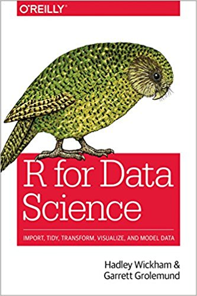

# Setup & Configuration

* The code below will load the libraries you will need for this tutorial.
```{r setup, results = 'hide'}
options(width = 100)
library(tibble)                         # special type of data frame
library(magrittr)                       # pipes
suppressMessages(library(dplyr))        # data manipulation
library(nycflights13)                   # toy data set
library(ggplot2)                        # pretty plots
library(reshape2)                       # melt/reshape data frames
suppressMessages(library(lubridate))    # working with dates/times
```
* The data we will be using today is available via the `nycflights13` package.
* R environment:
    +  Now is a good time to check that your version of R is up-to-date. If you are not running version 3.2.3 or later it is time to update. We will use a function from the `devtools` package to check your session info:
```{r, eval = FALSE}
devtools::session_info()
```


------------------------------------


# What is Data Wrangling?

**Data wrangling**, sometimes referred to as **data munging**, is the process of transforming and *mapping* data from one "raw" data form into another format with the intent of making it more appropriate and valuable for a variety of downstream purposes such as analytics. A data wrangler is a person who performs these transformation operations (see [wiki](https://en.wikipedia.org/wiki/Data_wrangling)).

### What's this tutorial about?
<center>
  
</center>


------------------------------------


# Pipes (`magrittr`)    

This is an idea that has been around for a long time, particularly in the Linux/Unix ecosystem, where it is denoted with the "|" symbol:

* Complex tasks can be accomplished by stringing together many simple tools - syntax is important for efficiency / readability
* The idea of pipes is that the result of the previous command is passed to the next command, which allows many tools to be strung together - from left to right.
* In R, `magrittr` introduces the `%>%` pipe operator which runs the expression of the left and passes the result as the *first* argument to expression on the right.

You can think about the following sequence of actions:

    1. find key
    2. unlock car
    3. start car
    4. drive to school
    5. park.
  
Expressed as a set of nested functions in R `pseudocode` this would look like:

```{r, eval = FALSE}
park(drive(start_car(find("keys")), to="campus"))
```

Writing it out using pipes give it a more natural (and easier to read!) structure:

```{r, eval = FALSE}
find("keys") %>%
    start_car() %>%
    drive(to="campus") %>%
    park()
```

# Approaches

All of the following are fine, it comes down to personal preference (and IMHO, readability):

```{r, eval = FALSE}
# Nested:
h( g( f(x), y = 1), z = 1 )

# Piped:
f(x) %>% g(y = 1) %>% h(z = 1)

# Intermediate:
res <- f(x)
res <- g(res, y = 1)
res <- h(res, z = 1)
```


But what about other arguments? Sometimes we want to send our results to an function argument other than first one or we want to use the previous result for multiple arguments. In these cases we can refer to the previous result using ".".

```{r}
data.frame(a = 1:3, b = 3:1) %>% lm(a ~ b, data = .)
data.frame(a = 1:3, b = 3:1) %>% .[[1]]
data.frame(a = 1:3, b = 3:1) %>% .[[length(.)]]
```


# Tibbles
## Modern data frames

Hadley Wickham has a package that modifies data frames to be more modern, or as he calls them *surly* and *lazy*. That is they don't change variable names or types, and don't do partial matching; and they complain more (e.g. when a variable does not exist). This forces you to confront problems earlier, typically leading to cleaner, more expressive code. Tibbles also have an enhanced `print()` method which makes them easier to use with large datasets containing complex objects.

```{r}
class(iris)
tbl_iris <- as.tibble(iris)
class(tbl_iris)
```

## Printing
```{r}
tbl_iris
```

## Lazy tibbles
```{r}
tbl_iris[1, ]
tbl_iris[, "Species"]
```


## Lazy tibbles (factors)
```{r}
data_frame(x = 1:3, y = c("A", "B", "C"))
```


## Surly Tibbles
```{r BadTibble, error = TRUE}
tbl_iris[, "Name"]      # errors out; invalid index
tbl_iris[["Name"]]      # same as above; different syntax
```

```{r BadTibble2}
iris$Name               # returns NULL
tbl_iris$Name           # returns NULL (with explanation!)
```

```{r BadTibble3}
tbl_iris[160, ]         # exceeded index; returns 1 row data frame of NAs
```


---------------------------------------------


# `dplyr` 
## A Grammar of Data Manipulation

The `dplyr` package is based on the concepts of functions as verbs that manipulate data frames.

Single data frame functions / verbs:

* `tbl_df()`: add the tbl_df class
* `filter()`: pick rows matching criteria
* `slice()`: pick rows using index(es)
* `select()`: pick columns by name
* `pull()`: grab a column as a vector
* `rename()`: rename specific columns
* `arrange()`: reorder rows
* `mutate()`: add new variables
* `transmute()`: create new data frame with variables
* `distinct()`: filter for unique rows
* `sample_n() / sample_frac()`: randomly sample rows
* `summarise()`: reduce variables to values
* ... and many more


## dplyr rules for functions

    1. First argument is always a data frame
    2. Subsequent arguments say what to do with that data frame
    3. Always return a data frame
    4. Do not modify in place
    5. Performance via lazy evaluation


----------------------------------------


# Example Data
We will demonstrate dplyr functionality using the `nycflights13` data which contains data on flights departing from New York City. It was written by Hadley Wickham and includes airline on-time data for all flights departing NYC in 2013 as well as useful *metadata* on airlines, airports, weather, and planes (see `?nycflights13`).

## Structure of `flights`

```{r flights_stucture}
flights %<>% as.tibble    # 'rebound' pipe; aka compound assignment
str(flights)
```


## Look at full "tibble"" data frame
```{r flights_tibble}
flights
```


---------------------------------------


# `dplyr` Verbs
## March flights `dplyr::filter`
```{r}
flights %>% filter(month == 3)
```

## First week of March flights `dplyr::filter`
```{r}
flights %>% filter(month == 3, day <= 7)
```

## Flights to LAX or RDU in March `dplyr::filter`
```{r}
flights %>% filter(dest == "LAX" | dest == "RDU", month==3)
```

## First 10 flights `dplyr::slice`
```{r}
flights %>% slice(1:10)
```

## Last 5 flights `dplyr::slice`
```{r}
flights %>% slice((n() - 5):n())
```

## Select columns `dplyr::select`
```{r}
flights %>% select(year, month, day)
```

## Exclude columns `dplyr::select`
```{r}
flights %>% select(-year, -month, -day)
```

## Select ranges `dplyr::select`
```{r}
flights %>% select(year:day)
```

## Exclude ranges `dplyr::select`
```{r}
flights %>% select(-(year:day))
```

## Select matching `dplyr::select`
```{r}
flights %>% select(contains("dep"), 
                   contains("arr"))

flights %>% select(starts_with("dep"), 
                   starts_with("arr"))
```

## Other helpers:
   - `current_vars`
   - `starts_with`
   - `ends_with`
   - `contains`
   - `matches`
   - `num_range`
   - `one_of`
   - `everything`


## Using `dplyr::pull`
```{r pull}
names(flights)
flights %>% pull("year") %>% head()
flights %>% pull(1) %>% head()
flights %>% pull(-1) %>% head()
```

## Change column names `dplyr::rename`
```{r}
flights %>% rename(tail_number = tailnum)
```

## select() vs. rename()
```{r}
flights %>% select(tail_number = tailnum, -tailnum)
flights %>% select(-tailnum, tail_number = tailnum)
```

## Sort data `dplyr::arrange`
```{r}
flights %>% filter(month == 3, day == 2) %>% arrange(origin, dest)
```


## Descending order `dplyr::arrange`
```{r}
flights %>% filter(month == 3, day == 2) %>%
  arrange(desc(origin), dest) %>% select(origin, dest, tailnum)

```

## Modify columns `dplyr::mutate`
```{r}
flights %>%
   select(1:3) %>%
   mutate(date = paste(month, day, year, sep="/") %>% mdy())
```

## Create new tibble from existing columns `dplyr::transmute`
```{r}
flights %>%
   select(1:3) %>%
   transmute(date = paste(month, day, year, sep="/") %>% mdy())
```

## Find unique rows `dplyr::distinct`
```{r}
flights %>%
   select(origin, dest) %>%
   distinct() %>%
   arrange(origin, dest)
```

## Sample rows `dplyr::sample_n`
```{r}
flights %>% sample_n(10)
```

## Sample rows `dplyr::sample_frac`
```{r}
flights %>% sample_frac(0.001)
```

## Summary via `dplyr::summarise`
```{r}
flights %>% mutate(date = paste(month, day, year, sep = "/") %>% mdy()) %>% 
   summarize(n(), min(date), max(date))
```

## Set Groupings `dplyr::group_by`
```{r}
flights %>% group_by(origin)
```

## Summarize Groups `dplyr::summarise dplyr::group_by`
```{r}
flights %>%
  group_by(origin) %>%
  mutate(date = paste(month, day, year, sep="/") %>% mdy()) %>%
  summarize(n(), min(date), max(date))
```


-----------------------------------------


# Plotting

No data wrangling and/or data exploration is complete without at least some visual exploration of the data. Asking yourself: what do I have here? how is my data (particularly my class variable or response variable) distributed? Are there any missing values? Negative values? 

```{r}
par(mfrow = c(2, 2))                             # make 2x2 grid for plots
par(mgp = c(2, 0.75, 0), mar = c(3, 4, 3, 1))    # graphics settings; squeeze margins
lapply(names(iris)[-5], function(class)
   boxplot(split(iris[[class]], iris$Species), main = class, col = 1:3)) %>%
   invisible   # pipe to invisible to suppress output
```

## The same via 
```{r}
thm <- theme_bw() +
  theme(
    panel.background = element_rect(fill = "transparent", colour = NA),
    plot.background = element_rect(fill = "transparent", colour = NA),
    legend.position = "top",
    legend.background = element_rect(fill = "transparent", colour = NA),
    legend.key = element_rect(fill = "transparent", colour = NA)
  )
theme_set(thm)

df <- reshape2::melt(iris, id.vars = "Species", variable.name = "Feature",
                     value.name = "cm") %>%
  mutate(Feature=gsub("\\.", " ", Feature))

ggplot(df, aes(y = cm, x = Species, fill = Species)) +
  geom_boxplot(color = "#1F3552", alpha = 0.75, size = 0.5) +
  scale_x_discrete(name = "Species") +
  ggtitle("Overall Title") +
  theme(plot.title = element_text(hjust = 0.5)) +
  facet_wrap(~Feature, ncol = 2) 
```


## Pairwise plots

Very useful for visually inspecting variables for patterns of interest. You will typically need to know your outcome of interest *a priori*, i.e. supervised analysis, or you will not know how to color the points.

```{r}
plot(iris[, -5], col=iris$Species)
```

Unfortunately there is no simple equivelant for pairwise plots in `ggplot2`, so we are forced to look at the variabels one at a time, or write our own wrapper function (homework??):

```{r}
ggplot(iris, aes(x = Sepal.Length, y = Sepal.Width, color = Species)) +
  geom_point(size = 2)
```


-----------------------------------------


# Exercises

    1. Which destinations have the highest average delays?

    2. How many flights to Los Angeles (LAX) did each of the legacy carriers (AA, UA, DL or US) have in May from JFK, and what was their average duration?

    3. Which plane (check the tail number) flew out of each New York airport the most?

    4. What was the shortest flight out of each airport in terms of distance? In terms of duration?

    5. Which date should you fly on if you want to have the lowest possible average departure delay? What about arrival delay?


### Plot with 

    6. Create a time series plot of each of the legacy carriers average departure delay by day and origin airport. It should look something like this:

```{r flights_ggplot, echo = FALSE}

flights %>%
  filter(carrier == c("AA", "UA", "DL", "US")) %>%
  group_by(carrier, day, origin) %>%
  summarise(n = n(), delay = mean(dep_delay, na.rm = TRUE)) %>%
  ggplot(aes(x = day, y = delay)) +
    geom_line() +
    facet_wrap(carrier ~ origin)
```

### Now Do It Yourself

    7. You have probably had enough of New York City flight times. Now take a look at either the `mtcars` or `mtcars2` data set and execute many of the same commands above while exploring this new, different data set.


----------------------------------


# Merging Data 

No data wrangling tutorial would be complete without a section on merging data. This will happen often. Data will come to you, perhaps from various sources, and you must combine the records (cases, samples, rows, etc.) based on a common indicator variable, usually some sort of *key* identifier variable (e.g. a name, a patient ID, etc.).

## Data manipulation is not complete without merging information

Two table functions / verbs, all functions have the form `f(a, b)`:

|   Function    |   What it does                                                 |
| ------------- | -------------------------------------------------------------- |
| `left_join`   | Join matching rows from `b` to `a`, preserving all rows of `a` |
| `right_join`  | Join matching rows from `a` to `b`, preserving all rows of `b` |
| `inner_join`  | Join data, preserving only rows with keys in both `a` and `b`  |
| `full_join`   | Join data, preserving all rows in both `a` and `b`             |
| `semi_join`   | Subset rows in `a` that have a match in `b`                    |
| `anti_join`   | Subset rows in `a` that do not have a match in `b`             |

## Joining Data

```{r addr}
addr <- data.frame(name = c("Alice", "Bob",
                            "Carol", "dave", "Eve"),
                   email = c("alice@company.com",
                             "bob@company.com",
                             "carol@company.com",
                             "dave@company.com",
                             "eve@company.com"),
                   stringsAsFactors = FALSE)
addr
```

```{r phone}
phone <- data.frame(name = c("Bob", "Carol",
                             "Eve", "Eve", "Frank"),
                    phone = c("919 555-1111",
                             "919 555-2222",
                             "919 555-3333",
                             "310 555-3333",
                             "919 555-4444"),
                    stringsAsFactors = FALSE)
phone
```


## Outer Join

In `dplyr`:
```{r}
full_join(addr, phone)
```

In `base R`:
```{r}
merge(addr, phone, all = TRUE)
```

## Inner Join

In `dplyr`:
```{r}
inner_join(addr, phone)
```

In `base R`:
```{r}
merge(addr, phone, all = FALSE)
```

## Left Join

In `dplyr`:
```{r}
left_join(addr, phone)
```

In `base R`:
```{r}
merge(addr, phone, all.x = TRUE)
```

## Right Join

In `dplyr`:
```{r}
right_join(addr, phone)
```

In `base R`:
```{r}
merge(addr, phone, all.y = TRUE)
```


## Semi and Anti Joins

```{r semi}
semi_join(addr, phone)   # semi
```

```{r anti}
anti_join(addr, phone)   # anti
```


## Special case: many-to-many relationships

```{r}
addr2 <- data.frame(name = c("Alice", "Alice", "Bob", "Bob"),
                    email= c("alice@company.com",
                             "alice@gmail.com",
                             "bob@company.com",
                             "bob@hotmail.com"),
                    stringsAsFactors = FALSE)
```

```{r}
phone2 <- data.frame(name = c("Alice", "Alice", "Bob", "Bob"),
                     phone = c("919 555-1111", "310 555-2222",
                               "919 555-3333", "310 555-3333"),
                     stringsAsFactors = FALSE)
```

In `dplyr`:
```{r}
full_join(addr2, phone2, by = "name")
```

In `base R`:
```{r}
merge(addr2, phone2)
```


## Example: Enhancing NYC Flight Data

The `nycflights13` package also contains additional information about:

|   Dataset     |   Description                                          |
| ------------- | ------------------------------------------------------ |
| `weather`     | hourly meterological data for each airport             |
| `planes`      | construction information about each plane              |
| `airports`    | airport names and locations                            |
| `airlines`    | translation between two letter carrier codes and names |


## Weather and Flight Delays

Let's take a quick look at the weather data, with an eye towards examining how it might affect things like flight departure delays.

```{r}
weather
```


## Join by?

Variable defintions in the `weather` dataset:

|   Variable    |   Description                              |
| ------------- | ------------------------------------------ |
| `origin`      | Weather station. Named origin to faciliate merging with flights data |
| `year`, `month`, `day`, `hour` | Time of recording         |
| `temp`, `dewp` | Temperature and dewpoint in Fahrenheit    |
| `humid`      | Relative humidity                           |
| `wind_dir`, `wind_speed`, `wind_gust` | Wind direction (in degrees), speed (in mph), and gust speed (in mph) |
| `precip`     | Preciptation, in inches                     |
| `pressure`   | Sea level pressure in millibars             |
| `visib`      | Visibility in miles                         |


<!--
* tailnum - Tail number
* year - Year manufactured
* type - Type of plane
* manufacturer - Manufacturer
* model - Model
* engines - Number of engines
* seats - Number of seats
* speed - Average cruising speed in mph
* engine - Type of engine
-->

```{r}
intersect(names(weather), names(flights))
```


## Joining flights and weather

When joining these two data frames I will use an inner join (because I only want the flights that have the weather data, and I only want weather data when there was a flight)

```{r, include = FALSE}
(flightsw <- inner_join(flights, weather))
```

Let's make a `ggplot` of the delay time vs. visibility:

```{r}
flightsw %>%
  ggplot(aes(x = visib, y = dep_delay)) +
  geom_point()
```


Let's take a closer look at the dependent variable: visibility:

```{r}
flightsw %>%
  ggplot(aes(x = visib)) +
  geom_histogram(fill = "blue")
table(flightsw$visib)
```


Wow! The vast majority of flights are under clear skies with `> 10` miles visibility. Good to know.

```{r}
flightsw %>%
  ggplot(aes(x = visib, y = dep_delay)) +
  geom_jitter(shape = 21, color = "blue", fill = "gray", size = 1.5, width = 0.2) +
  geom_smooth(color = 'red')
```


There are many *negative* departure time values (early!), which stop us from plotting the y-axis on a log-scale (which might be more visually appealing) ... let's boxplot but remove them first:

```{r}
flightsw %>%
  filter(dep_delay > 0)  %>% 
  mutate(visib %<>% factor) %>%
  ggplot(aes(x = visib, y = dep_delay, group = visib)) +
  geom_boxplot(fill = "blue", color = "gray") +
  coord_trans(y = "log10") +
  xlab("Visibility") +
  ylab("Departure Delay")
```


------------------------------


# More Exercises

1. Check some of the other weather variables (e.g. `temp`, `wind_speed`, `etc`) and see if you can find any relationship between them and departure delay (`dep_delay`).

2. Merge the `flights` data with the `planes` data set (pay attention to what columns are being used for the join). Are older planes more likely to be delayed? What about planes from Airbus vs Boeing vs Embraer?


--------------------------------------


# Acknowledgments

Above materials are derived in part from the following sources:

* [RStudio Data Wrangling Cheat Sheet](http://www.rstudio.com/wp-content/uploads/2015/02/data-wrangling-cheatsheet.pdf)

* Package Vignettes:
    + [dplyr](http://cran.r-project.org/web/packages/dplyr/vignettes/introduction.html)
    + [tidyr](http://cran.r-project.org/web/packages/tidyr/vignettes/tidy-data.html)
    
* Hadley Wickham's new book:
    + [R for Data Science](http://r4ds.had.co.nz/)


